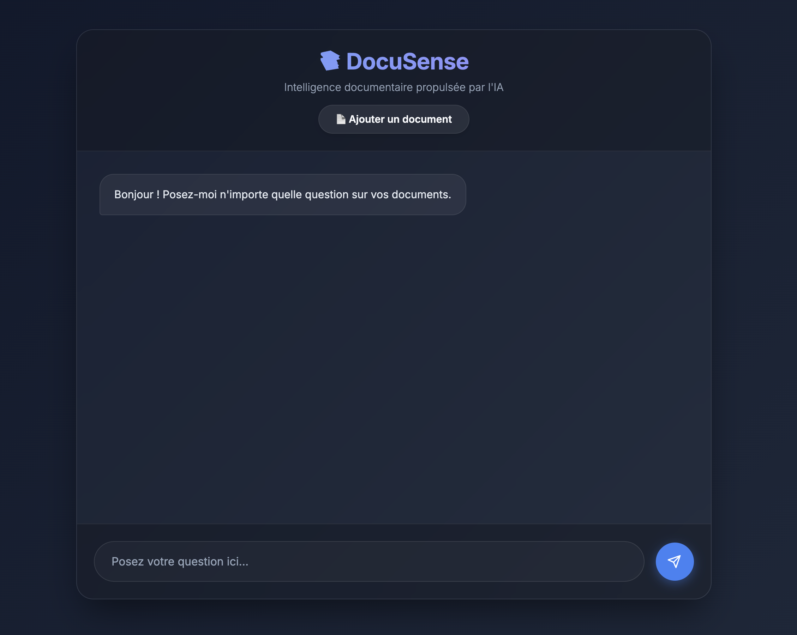

# 📚 DocuSense

> DocuSense is a Retrieval-Augmented Generation (RAG) system that enables users to query a collection of PDF documents using natural language. Instead of manually searching through dozens of files, users can simply ask a question and receive a precise answer generated by a Large Language Model (LLM), grounded in the actual content of the documents. Designed as a B2B solution, DocuSense helps organizations quickly extract relevant information from their internal documentation.


## 🖼️ Demo


## 🛠️ Tech Stack
| Layer | Technology |
|-------|-----------|
| Parsing | PyMuPDF |
| Embeddings | SentenceTransformers |
| Vector DB | ChromaDB |
| LLM | Groq (Llama 3.1) |
| API | FastAPI |
| Frontend | HTML / CSS / JS |

## 🚀 Getting Started

### Installation
```bash
pip install -r requirements.txt
```

### Ingest your documents
```bash
python3 ingest.py
```

### Run the server
```bash
uvicorn src.api:app --reload
```

## 🔮 Future Improvements
- Advanced PDF parsing & OCR support
- Multi-tenant session management  
- Document deletion endpoint
- Streaming responses
